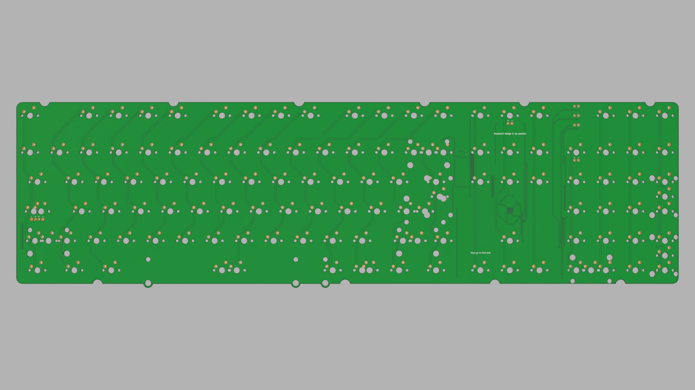
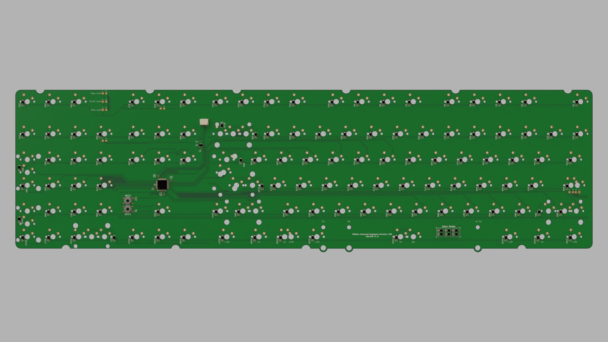
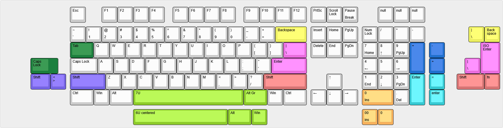

# FUKC10X — Fullsize Universal Keyboard Circuitry 10X

> 🚧 **Work in Progress** — This PCB has **not yet been prototyped** and currently has **no firmware**.
---

## Introduction

**Fullsize Universal Keyboard Circuitry 10X or fukc10X for short**, is an open-source, full-size (100%) mechanical keyboard PCB designed in KiCad. It's essentially a Daughterboard only h87 footprint pcb just with a numpad attached.

This came to life after i wanted to design a Fullsize Keyboard but found out there were no modern opensource full-size keyboard pcbs.

---

## Features
- Dual Indicators. You can have indicator leds for Caps Lock, Scroll Lock and Num Lock directly at the switches for the use with windowed Keycaps and above the numpad in a small cluster.
- Decent layout support with ANSI+ISO Enter, split l-shift, split r-shift, split backspace, split numpad Enter, split numpad plus and split numpad minus (just check the diagramm)
- Supported bottomrows are Tsangan **7U** aswell as **6U** bottom row, like the Realforce R1 87U. (*I will not be adding 6.25u bottom row*)

---

##  Design Files

The files were designed in KiCAD 10.0 and the [marbastlib](https://github.com/ebastler/marbastlib) was used for MX footprint/symbols.

---

## Supported Layouts

---

## Daughterboard Connector

Uses standard 4-pin JST commonly found on all sorts of Keyboard PCBs. Compatible with any daughterboard that follows the [ai03 unified daughterboard standard](https://unified-daughterboard.github.io/#/) pinout.

---

## Firmware

> ⚠️ **Firmware is not yet written.**

| Firmware | Status |
|---|---|
| **[QMK](https://qmk.fm/)** | Planned after i get Prototypes. |
| **[VIAL](https://get.vial.today/)** | Planned after i get Prototypes. |
| **[VIA](https://www.caniusevia.com/)** | Maybe? |

---

## License

This project is licensed under **Creative Commons Attribution-NonCommercial-ShareAlike 4.0 International** ([CC BY-NC-SA 4.0](https://creativecommons.org/licenses/by-nc-sa/4.0/)).

- You are free to produce, modify, and manufacture this design for private use (personal, non-commercial purposes) or small scale non-commercial production runs of 50 units or fewer.
- For larger non-Profit or commercial runs feel free to message me on Discord *@0ver.heaven*
---

*This README was written with the help of deepseek-v4-pro because i suck at stuff like this.*
